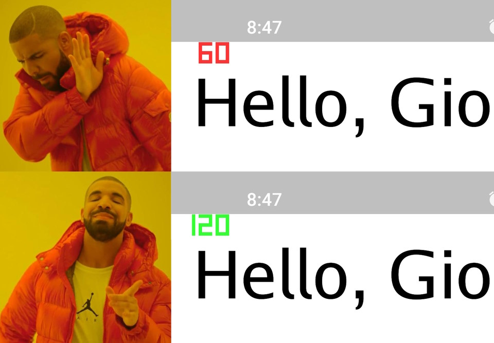

GioRefreshRate
--------

Allows to set the display refresh rate on Android. Some manufacturers limit apps using SurfaceView (such as gio) to 60hz, this library can bring it back and have that scroll be smooth.



## Getting Started

Run `go get github.com/ilidemi/giorefreshrate`

Call `giorefreshrate.PreferHighRefreshRate()` or `giorefreshrate.PreferLowRefreshRate()` before the event loop and provide `giorefreshrate` access to the Window events:

```diff
+   giorefreshrate.PreferHighRefreshRate()

    for e := range w.Events() { // Gio main event loop
+       giorefreshrate.ListenEvents(e, w)

        switch e := e.(type) {
            // ...
        }
    }
```

## Notes

Uses the same approach as [flutter_displaymode](https://github.com/ajinasokan/flutter_displaymode).